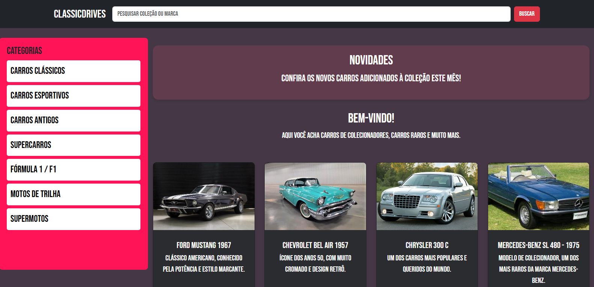
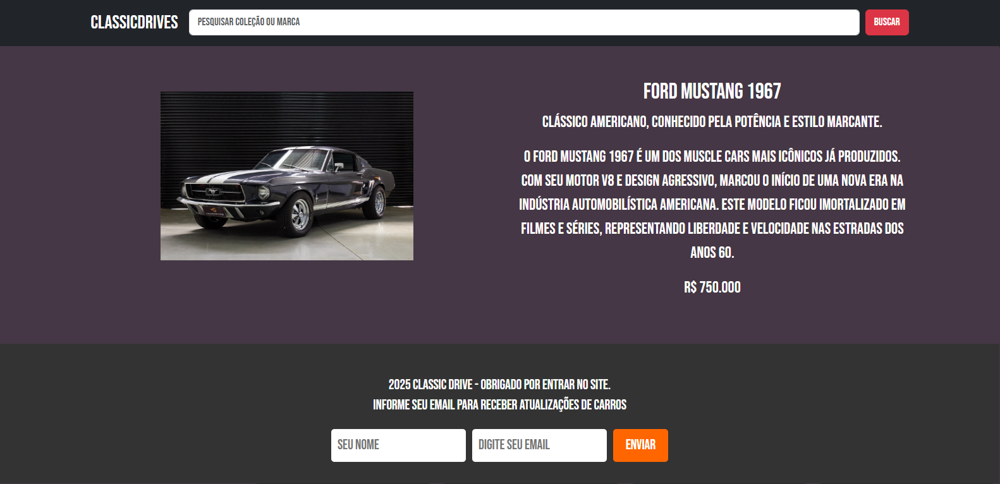

[](https://classroom.github.com/online_ide?assignment_repo_id=20891959&assignment_repo_type=AssignmentRepo)
# Trabalho Prático 05 - Semanas 7 e 8

**Páginas de detalhes dinâmicas**

Nessa etapa, vamos evoluir o trabalho anterior, acrescentando a página de detalhes, conforme o  projeto escolhido. Imagine que a página principal (home-page) mostre um visão dos vários itens que existem no seu site. Ao clicar em um item, você é direcionado pra a página de detalhes. A página de detalhe vai mostrar todas as informações sobre o item do seu projeto. seja esse item uma notícia, filme, receita, lugar turístico ou evento.

Leia o enunciado completo no Canvas. 

**IMPORTANTE:** Assim como informado anteriormente, capriche na etapa pois você vai precisar dessa parte para as próximas semanas. 

**IMPORTANTE:** Você deve trabalhar e alterar apenas arquivos dentro da pasta **`public`,** mantendo os arquivos **`index.html`**, **`styles.css`** e **`app.js`** com estes nomes, conforme enunciado. Deixe todos os demais arquivos e pastas desse repositório inalterados. **PRESTE MUITA ATENÇÃO NISSO.**

## Informações Gerais

- Nome: Isaac de Oliveira Lima
- Matricula: 898044
- Proposta de projeto escolhida: Coleções e Itens
- Breve descrição sobre seu projeto: Um site sobre carros e motos de colecionadores. O objetivo do site é mostra o valor de mercado dos carros colecionaveis, ficha tecnica, e curiosidades dos carros.

## Print da Home-Page



## Print da página de detalhes do item



## Cole aqui abaixo a estrutura JSON utilizada no app.js

```javascript
const carros = [
  { 
    id: 1, 
    nome: "Ford Mustang 1967", 
    descricao: "Clássico americano, conhecido pela potência e estilo marcante.", 
    imagem: "img/Ford Mustang 1967.jpg",
    preco: "R$ 750.000",
    detalhes: "O Ford Mustang 1967 é um dos muscle cars mais icônicos já produzidos. Com seu motor V8 e design agressivo, marcou o início de uma nova era na indústria automobilística americana. Este modelo ficou imortalizado em filmes e séries, representando liberdade e velocidade nas estradas dos anos 60."
  }
];